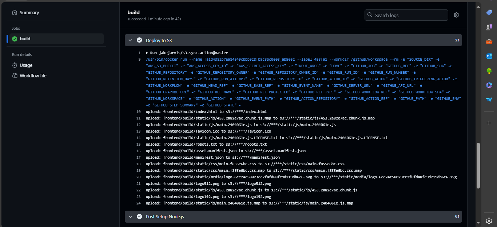

# Hackathon IT Talent 2024 - Terceiro Hackathon

Este projeto foi desenvolvido para o terceiro hackathon da turma DevOps 2024 do IT Talent, com base nos conhecimentos adquiridos até o momento.

## Descrição do Projeto

O objetivo deste projeto é demonstrar a integração de várias tecnologias aprendidas ao longo do curso, incluindo Docker, SonarQube, GitHub Actions e AWS S3. A aplicação consiste em um processo automatizado para construir e implantar uma aplicação React em um bucket S3 da AWS após realizar análises de qualidade de código usando SonarQube.

## Estrutura do Repositório

- **backend/**: Contém as configurações do SonarScanner para análise de código.
- **frontend/**: Contém o código da aplicação React.
- **.github/workflows/deploy.yml**: Fluxo de trabalho do GitHub Actions para automação do build e deploy.

## Passo a Passo

### 1. Configuração do SonarQube

No diretório `backend`, estão as configurações do SonarQube para análise de código. Para utilizá-lo:

- Clone este repositório para o seu ambiente local.
- Substitua o token de acesso no arquivo de configuração conforme necessário.


### 2. Fluxo de Trabalho do GitHub Actions

O fluxo de trabalho `deploy.yml` na raiz do repositório realiza as seguintes etapas:

- **Checkout do código**: Baixa o código fonte do repositório.
- **Configuração do ambiente Node.js**: Instala a versão especificada do Node.js.
- **Instalação de dependências**: Instala as dependências do projeto React localizadas em `frontend/`.
- **Construção do projeto**: Executa o comando de build da aplicação React.
- **Deploy para S3**: Sincroniza a pasta `frontend/build` com um bucket S3 na AWS.


### 3. Como Usar

Para testar e executar este projeto localmente:

1. Clone o repositório:

   ```bash
   git clone https://github.com/seu-usuario/nome-do-repositorio.git
   cd nome-do-repositorio
   ```

2. Configure o SonarQube:

   - Siga as instruções em `backend/README.md` para configurar o SonarQube com o token gerado localmente.

3. Execute o fluxo de trabalho do GitHub Actions:

   - Certifique-se de configurar as variáveis de ambiente `AWS_S3_BUCKET`, `AWS_ACCESS_KEY_ID` e `AWS_SECRET_ACCESS_KEY` nos Secrets do seu repositório GitHub.

4. Visualize a aplicação:

   - Após o deploy, você pode acessar a aplicação React no link público do seu bucket S3.

---

Este projeto foi realizado com o auxílio e suporte do [Mauro](https://github.com/mauro-n), que contribuiu significativamente para a sua implementação e sucesso durante o hackathon.

## Imagens





## Vídeo que me auxiliou

